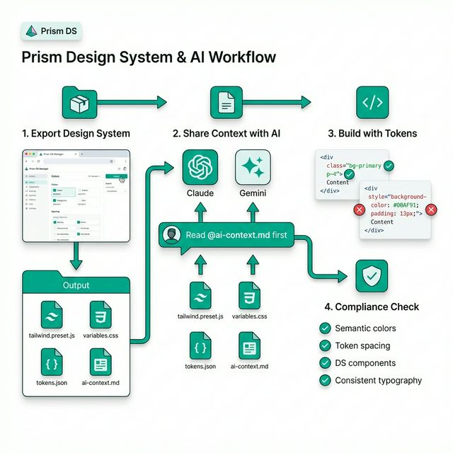

# Using Prism Design System with AI Assistants (Claude & Gemini)



## 🎯 The Challenge

When working with AI coding assistants like Claude Code or Gemini CLI, maintaining design consistency is difficult because:
- AIs don't automatically know your design system
- Each conversation starts fresh without context
- AIs tend to create custom styles instead of using your tokens
- Hard to enforce consistency across multiple projects

## ✅ The Solution: Context-First Workflow

### Step 1: Export Your Design System Context

1. **Open the DS Manager**: https://hoppal.github.io/DS_Manager/
2. **Customize your tokens** (if needed) in the Design Tokens tab
3. **Click "Export Config"** button (top right)
4. **Save the exported files** to a shared location:

```bash
# Recommended structure
~/AI Development/design-system/
├── tailwind.preset.js
├── variables.css
├── tokens.json
├── documentation.md
└── ai-context.md  # ← Most important for AI tools
```

### Step 2: Create an AI Context File

The `ai-context.md` file should contain everything the AI needs to know. Here's a template:

```markdown
# Prism Design System - AI Context

## Design System URL
https://hoppal.github.io/DS_Manager/

## Core Principles
- ALWAYS use semantic color names (primary, success, error, warning, neutral)
- NEVER hardcode colors or spacing values
- Use Tailwind utilities with our preset
- Reference this context before creating any UI components

## Color Palette
- Primary: #00AF91 (teal)
- Success: #22C55E (green)
- Error: #EF4444 (red)
- Warning: #F97316 (orange)
- Neutral: #6B7280 (gray)

Use as: `bg-primary`, `text-success`, `border-error`

## Spacing Scale
- Use Tailwind spacing: `p-4`, `m-6`, `gap-8`
- Internal padding default: 24px
- Presets: Compact (12px), Cozy (24px), Spacious (36px)

## Typography
- Headings: Inter font family
- Body: Inter font family
- Code: JetBrains Mono

Use as: `font-h1`, `text-h2`, `font-body`

## Border Radius
- Default: 8px
- Use as: `rounded-lg` (8px), `rounded` (4px), `rounded-xl` (12px)

## Component Library
Available components from @oppal/ui:
- StatCard (with sparklines)
- Button (variants: primary, secondary, outline, ghost, danger)
- Card, CardHeader, CardTitle, CardContent
- Alert (variants: info, success, warning, error)
- DataTable
- Input
- DonutChart

## Icons
- Use lucide-react icons
- 77 icons available across 11 categories
- See full list: https://hoppal.github.io/DS_Manager/#/manager (Icons tab)

## Best Practices for AI
1. Ask to see this context file at the start of each session
2. Request "Prism-compliant" components
3. Use semantic naming, not hex codes
4. Build with existing components before custom CSS
5. Check the live DS Manager for visual reference
```

### Step 3: Workflow with Claude Code

#### Starting a New Project

```bash
# 1. Create project
mkdir my-new-project && cd my-new-project
npx create-vite@latest . --template react

# 2. Copy design system files
cp ~/AI\ Development/design-system/* ./src/styles/

# 3. Install dependencies
npm install -D tailwindcss postcss autoprefixer
npm install lucide-react
```

#### In Your Claude Conversation

**First Message:**
```
I'm starting a new React project that MUST use the Prism Design System.

Please read this context file first:
@ai-context.md

Key requirements:
1. Use Tailwind with our preset (tailwind.preset.js)
2. Only use semantic colors (bg-primary, text-success, etc.)
3. Use components from @oppal/ui when available
4. Reference the DS Manager for visual examples: https://hoppal.github.io/DS_Manager/

Let's start by setting up the Tailwind config to use our preset.
```

**During Development:**
```
Create a dashboard page with:
- 3 StatCards showing revenue metrics
- A DataTable for recent transactions
- Primary and secondary action buttons

Remember: Use Prism Design System components and tokens only.
Check @ai-context.md for the component API.
```

**Before Finishing:**
```
Review the code for Prism compliance:
1. Are all colors using semantic names (not hex)?
2. Are all components from @oppal/ui or using our tokens?
3. Is spacing using the Tailwind scale (not arbitrary values)?

Fix any violations.
```

### Step 4: Workflow with Gemini CLI

#### Project Setup

Create a `.gemini` directory in your project root:

```bash
mkdir -p .gemini
cp ~/AI\ Development/design-system/ai-context.md .gemini/
```

#### In Your Gemini Conversation

**First Message:**
```
I'm building a React app using the Prism Design System.

IMPORTANT: Read .gemini/ai-context.md first for design system rules.

All UI must follow these constraints:
- Semantic colors only (bg-primary, text-success, etc.)
- Use @oppal/ui components
- Tailwind utilities with our preset
- No hardcoded values

Confirm you've read the context, then let's set up Tailwind.
```

**During Development:**
```
Create a user profile page with:
- Card component for user info
- StatCards for user metrics
- Alert for account status
- Buttons for actions

Use ONLY Prism DS components and tokens from .gemini/ai-context.md
```

### Step 5: Maintaining Consistency Across Projects

#### Create a Shared Template

```bash
# Create a template directory
mkdir -p ~/AI\ Development/templates/prism-react-app

# Set up the template
cd ~/AI\ Development/templates/prism-react-app
npx create-vite@latest . --template react

# Copy design system files
mkdir -p src/styles
cp ~/AI\ Development/design-system/* src/styles/

# Configure Tailwind
npm install -D tailwindcss postcss autoprefixer
npx tailwindcss init -p

# Update tailwind.config.js
cat > tailwind.config.js << 'EOF'
module.exports = {
  presets: [require('./src/styles/tailwind.preset.js')],
  content: ['./src/**/*.{js,jsx,ts,tsx}'],
}
EOF

# Create .gemini context
mkdir .gemini
cp src/styles/ai-context.md .gemini/
```

#### Start New Projects from Template

```bash
# Copy template
cp -r ~/AI\ Development/templates/prism-react-app my-new-project
cd my-new-project

# Install dependencies
npm install

# Start with AI
# Then tell Claude/Gemini: "Read .gemini/ai-context.md for design system rules"
```

## 🎨 Pro Tips for AI Consistency

### 1. **Use Project Rules** (Gemini-specific)

Create `.gemini/rules.md`:

```markdown
# Project Rules

## Design System
- ALWAYS read .gemini/ai-context.md before creating UI
- NEVER use hardcoded colors (no #00AF91, use bg-primary)
- NEVER use arbitrary spacing (no p-[13px], use p-4)
- ALWAYS use @oppal/ui components when available

## Validation
Before completing any UI task:
1. Check all colors are semantic (bg-primary, text-success, etc.)
2. Check all spacing uses Tailwind scale (p-4, m-6, gap-8)
3. Check components are from @oppal/ui or use our tokens
4. Show me a screenshot or code snippet for review
```

### 2. **Create Reusable Prompts**

Save these as snippets:

**Prism Compliance Check:**
```
Review the last changes for Prism Design System compliance:

1. Colors: Are all using semantic names (bg-primary, text-success)?
2. Spacing: Are all using Tailwind scale (p-4, m-6)?
3. Components: Are all from @oppal/ui or using our tokens?
4. Typography: Are all using our font families?

List any violations and fix them.
```

**Component Request:**
```
Create a [COMPONENT_NAME] using Prism Design System.

Requirements:
- Use @oppal/ui components
- Semantic colors only (bg-primary, text-success, etc.)
- Tailwind spacing scale
- Reference: https://hoppal.github.io/DS_Manager/

Show me the code and a description of which DS components you used.
```

### 3. **Visual Verification Workflow**

```
After creating UI:
1. Take a screenshot or show me the rendered output
2. Open https://hoppal.github.io/DS_Manager/ side-by-side
3. Compare colors, spacing, and components
4. Point out any differences
5. Fix to match the DS Manager exactly
```

### 4. **Update Workflow**

When you change design tokens:

```bash
# 1. Update in DS Manager
# https://hoppal.github.io/DS_Manager/

# 2. Export new config
# Click "Export Config" button

# 3. Replace files in all projects
cp ~/Downloads/prism-design-system/* ~/AI\ Development/design-system/

# 4. Update each project
cd my-project
cp ~/AI\ Development/design-system/* src/styles/

# 5. Tell AI about the update
# "The design system has been updated. Re-read ai-context.md and update all components to use the new tokens."
```

## 📋 Quick Reference Commands

### For Claude Code

```bash
# Start new project
"Read @ai-context.md. Set up Prism Design System with Tailwind preset."

# Create component
"Create [component] using Prism DS. Check @ai-context.md for tokens."

# Compliance check
"Review code for Prism compliance. Fix any hardcoded values."
```

### For Gemini CLI

```bash
# Start new project
"Read .gemini/ai-context.md. Configure Tailwind with Prism preset."

# Create component
"Build [component] per .gemini/ai-context.md. Use @oppal/ui components."

# Compliance check
"Validate against .gemini/ai-context.md. List and fix violations."
```

## 🚀 Example: Complete Workflow

```bash
# 1. Start new project
mkdir analytics-dashboard && cd analytics-dashboard
cp -r ~/AI\ Development/templates/prism-react-app/* .
npm install

# 2. Start AI session (Claude or Gemini)
# First message:
"I'm building an analytics dashboard using Prism Design System.

Read .gemini/ai-context.md for all design rules.

Create a dashboard with:
- 4 StatCards (revenue, users, conversion, churn)
- DataTable for recent events
- DonutChart for traffic sources
- Primary CTA button

Use ONLY Prism components and semantic tokens."

# 3. During development
"Add a filters section with:
- Date range picker
- Category dropdown
- Search input

Use Input component from @oppal/ui and semantic colors."

# 4. Before finishing
"Final Prism compliance check:
1. All colors semantic? (bg-primary vs #00AF91)
2. All spacing from scale? (p-4 vs p-[13px])
3. All components from @oppal/ui?
4. Typography using our fonts?

Fix any issues and show me a summary."
```

## 🎯 Success Metrics

You'll know this workflow is working when:

✅ AI consistently uses semantic color names  
✅ No hardcoded hex values in code  
✅ All spacing uses Tailwind scale  
✅ Components match DS Manager visually  
✅ New projects look cohesive with existing ones  
✅ Design updates propagate easily across projects  

## 🔗 Resources

- **DS Manager**: https://hoppal.github.io/DS_Manager/
- **Component Gallery**: https://hoppal.github.io/DS_Manager/#/manager (Component Gallery tab)
- **Icon Browser**: https://hoppal.github.io/DS_Manager/#/manager (Icons tab)
- **Integration Guide**: https://hoppal.github.io/DS_Manager/#/manager (Integration Guide tab)

---

**Remember**: The key to consistency is making the AI read your context file FIRST, then enforcing compliance checks BEFORE completing tasks. Treat the DS Manager as your source of truth and reference it often!
